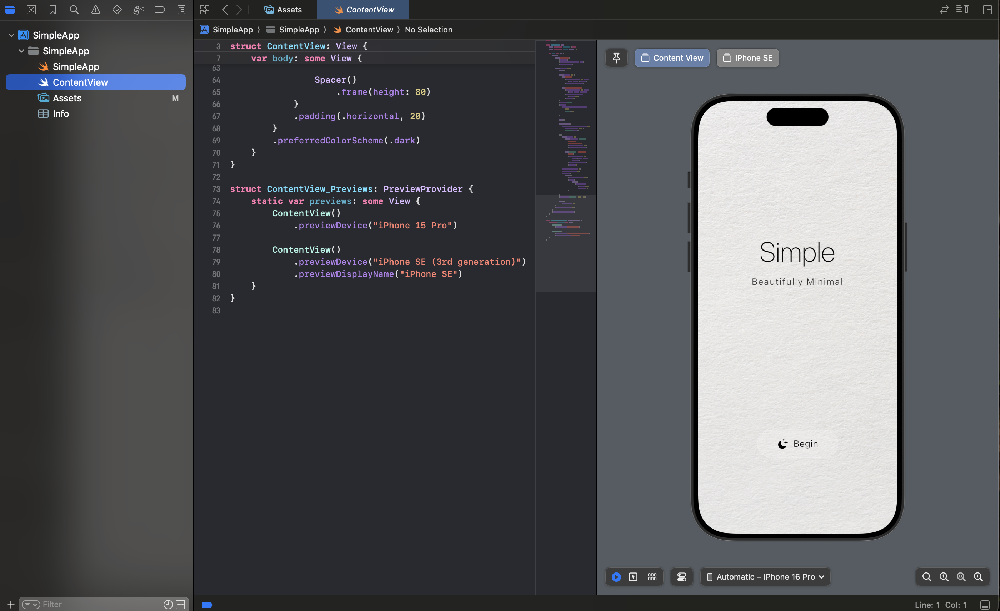

# SwiftUI Playground - A Weekend Experiment

You know that feeling when you have a perfectly good weekend ahead of you, and instead of touching grass, you decide to dive headfirst into mobile frameworks? No? Just me? Cool, cool.

Well, I did it anyway. Here's what I learned while my coffee went cold.


## The Mission

I wanted clear visibility on the mobile landscape. No hot takes. No Medium posts from 2019. Just hands-on experience with the actual options in 2025.

So I built a full Swift playground app and put it on my actual phone. Simple stuff, but I had a blast diving into it.

This is a minimalist iOS application built with SwiftUI - clean design, smooth animations, and a foundation for future experiments. Nothing fancy, but it runs smoothly and gave me a solid foundation to build on.

## What's Inside

- 🎨 Clean, minimalist design that actually looks good
- ✨ Smooth animations that don't make you cringe
- 🌟 Interactive UI elements that respond properly
- 📱 Responsive layout for all iPhone sizes
- 🎯 SwiftUI best practices (learned the hard way)
- 🏗️ Modern iOS 17+ architecture
- ☕ Built while coffee went cold (true story)

## Screenshots

### Xcode Development View
<p align="center">
  
</p>

### Mobile App Preview

[📱 Mobile App Demo Video](assets/)

## Requirements

- iOS 17.0+
- Xcode 15.0+
- Swift 5.9+

## Getting Started (It's Actually Easy)

1. Clone this thing:
```bash
git clone https://github.com/ThoBustos/swiftui-playground.git
cd swiftui-playground
```

2. Open it in Xcode (because that's where the magic happens):
```bash
open SimpleApp.xcodeproj
```

3. Pick your device/simulator (I recommend your actual phone for the full experience)

4. Hit ⌘+R and watch the magic happen

**Pro tip:** If you want it on your actual iPhone (which you totally should), you'll need to:
- Enable Developer Mode: Settings → Privacy & Security → Developer Mode (turn it on, restart phone)
- Approve the developer certificate: Settings → VPN & Device Management
- Build and enjoy that "I made this" feeling

## Project Structure

```
SimpleApp/
├── SimpleApp.swift          # App entry point
├── ContentView.swift        # Main UI view
├── Assets.xcassets/         # Images and colors
└── Info.plist              # App configuration
```

## What I Learned

SwiftUI's declarative syntax just clicks. You describe what you want, and the framework handles the rest. `@State` for local state management, stacks for layout, `.withAnimation` for smooth transitions. It all flows once you learn the vocabulary.

The best part? The whole thing is just clean, readable Swift. No magic, no hidden complexity. Just code that makes sense.

### The Real Magic
That moment when you tap the app icon and see your code running on hardware you're holding? Still hits different.

## Coming Soon: The Liquid Glass Button Dream

I wanted to end this weekend by building a super cool liquid glass button—you know, that iOS-style frosted, fluid effect that just looks premium. I had the Figma reference ready. I was ready.

Then I hit a wall: my Mac is running an older OS, which means I can't get Xcode 16 (the version with the new liquid glass APIs). The compatibility just isn't there.

So I'm updating my Mac and that's the next experiment. Some liquid glass effects are available in older Xcode versions, but the new stuff—the really good stuff—requires the latest tooling. I want to build something that looks beautiful, so I'm going to do it right.

The button is coming.

## The Real Takeaway

Shipping mobile apps isn't hard. The frameworks change. The tooling evolves. But the core idea stays the same: write some code, build it, put it on a device, ship it.

I went from zero to a working app on my phone in one Saturday. So can you.

### SwiftUI Concepts Used
- `@State` for local state management
- View modifiers for styling
- Animations with `.withAnimation`
- Custom layouts with VStack/HStack/ZStack
- Asset catalog integration

## Contributing

Contributions are welcome! Please feel free to submit a Pull Request.

1. Fork the project
2. Create your feature branch (`git checkout -b feature/AmazingFeature`)
3. Commit your changes (`git commit -m 'Add some AmazingFeature'`)
4. Push to the branch (`git push origin feature/AmazingFeature`)
5. Open a Pull Request

## Documentation

For a comprehensive guide on SwiftUI development and app deployment, see [SwiftUI_Guide.md](SwiftUI_Guide.md).

## License

This project is licensed under the MIT License - see the [LICENSE](LICENSE) file for details.

## Author

Thomas Bustos - [@ThoBustos](https://github.com/ThoBustos)

Built this while my coffee went cold on a perfectly good weekend. Sometimes the best projects come from "what if I just tried this?" moments.

---

<p align="center">
  Made with ❤️ and cold coffee using SwiftUI
</p>

*Now go build something.*